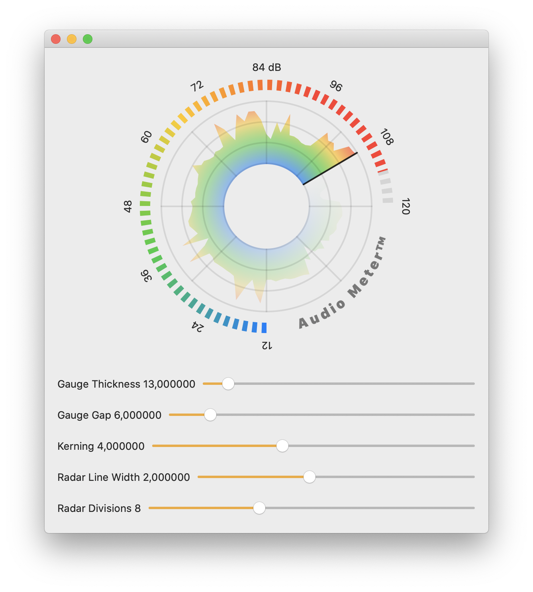

# Custom UI Prototype in SwiftUI

An example of a a prototype of a custom UI made in [SwiftUI](https://developer.apple.com/xcode/swiftui/). The custom UI tries to visualize the sound level, both the instantaneous as well as the sound level over time.

The example was used in a talk by [Tobias Due Munk](https://twitter.com/tobiasdm) at the [dotSwift](https://www.dotconferences.com/2020/02/tobias-due-munk-prototyping-custom-ui-in-swiftui) February 3, 2020. See the [video recording](https://www.youtube.com/watch?v=1BHHybRnHFE) of the talk to better understand the decision making behind the UI implementation.

The UI is hugely inspired by the [LoudnessRadar](https://www.tcelectronic.com/Categories/Tcelectronic/Computer-Audio/Plug-Ins-%26-Add-On-Licenses/ADOBE-LOUDNESS-RADAR/p/HE005) by T.C. Electronic.